## Game Hacking Report


### Tools

- **PE Analysis**: PEStudio 
- **Memory Scanning**: CheatEngine
- **Reverse Engineering**: 
  - Static Analysis: IDAPro 7.7
  - Dynamic Analysis: X32Dbg 
- **Development**: Visual Studio

### Target 
- **Game**: Age of Empires: Rise of rome
- **Platform**: Windows
- **Architecture**: 32-bit

---

## Research

### Memory Scanning
#### Objectives:
To locate the memory address of in-game objects during runtime, enable further analysis and modification.

#### Theory:
1. **Identify the Object of Interest:**
   - Launch the game and determine which in-game object you want to manipulate (e.g., player health, ammo count, or position).

2. **Attach a Memory Scanner:**
   - Use tools like Cheat Engine or x64dbg to attach to the game's process.

3. **Perform a Value Search:**
   - Search for the initial value of the object (e.g., current health) in the memory scanner.
   - Refine the results by updating the value in-game and rescanning until a single address is identified.

4. **Validate the Address:**
   - Confirm the address by modifying its value and observing the effect in-game.

#### Practice:

- Finding for food value by first scan for floating value of any resources in the game and spent some to change values then perform second scan:

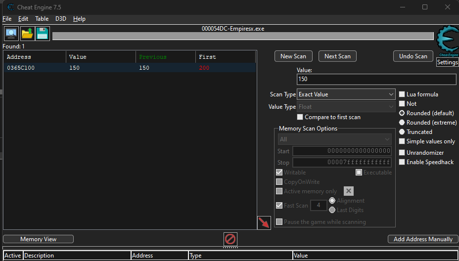
- After retrieve address of the resource at `0x0365C100`, we could modify it's to see if it's actually the correct address: 
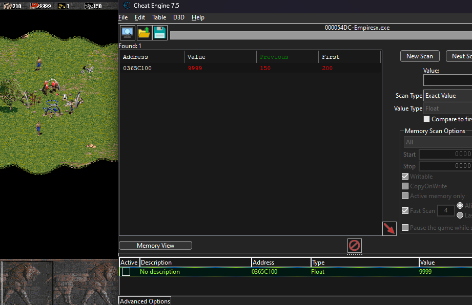

- We could also do this in X32Dbg by search for a pattern. But the process is much more complicated than using CheatEngine. But the hex view of X32Dbg might be worth it: 

- At the same memory location, we also found other resources: 
  -  Food 
  -  Wood
  -  Gold 
  -  Stone 
  -  Max Population
  -  Current Population 
  -  Age
  -  Technology Count (Changing this will take effect on the game, but the icons to update will still be there)
  -  Player Scores 
  -  Map Exploration (We couldn't patch this value, however, we could know which asm instruction access this memory location then do more reversing to get the logic of its)

- We have found the right address. However, this is a dynamic address. Which means if the game starts again, the address is going to be different. We need to find a static pointer that always points to this dynamic address, this way we could know the address of the player's object everytime the game starts. 
---

### Retrieve Multi-Level Pointers
#### Objectives:
To find the pointer that consistently points to the memory location of the object, even after the game restarts.

#### Theory:
1. **Locate the Dynamic Address:**
   - Start by identifying the dynamic address of the object as described in the memory scanning process.

2. **Pointer Scan:**
   - Use the memory scanner's pointer scan feature to identify potential pointers to the dynamic address.

3. **Test Pointer Stability:**
   - Restart the game and verify if the pointers still lead to the correct object. Eliminate invalid pointers.

4. **Resolve Multi-Level Pointers:**
   - If the pointer is indirect, repeat the process to find pointers to the base address. This process continues until a reliable base pointer is identified.

#### Practice:
- How the multi-level Pointer works:
  - Basic, it dereferences a next pointer to get to the next pointer until it reaches the final destination
- This step is straight forward, we just need to perform a pointer scan for the address:
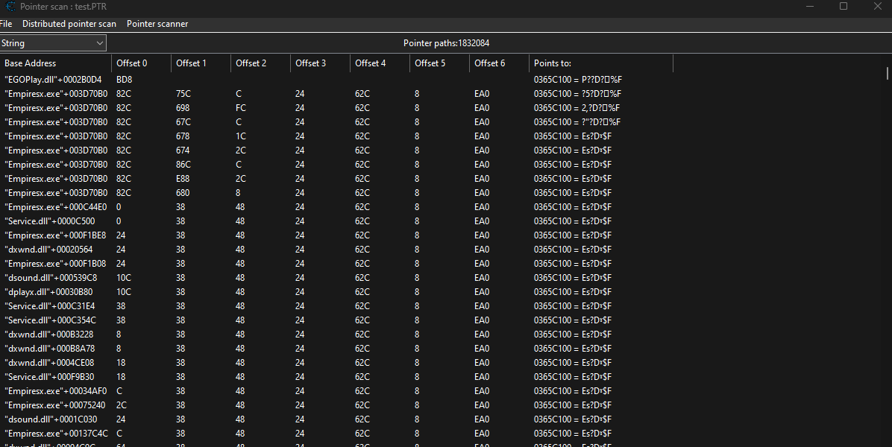
- We could use any of these pointers found in the table scan with base address is `Empiresx.exe`
- By referencing the pointer, we could get the final address of the player object:
  
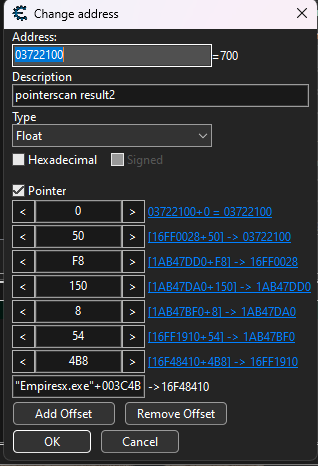

- Referencing each pointer to get to the final Address by using `ReadProcessMemory` API, iterate through each pointer to get to the final address:
```c
 // +10000 Food, Wood, Gold, Stone 
 HWND hGameWindow = FindWindow(NULL, L"Age of Empires Expansion");

 DWORD pID = 0;
 GetWindowThreadProcessId(hGameWindow, &pID);
 HANDLE processHandle = OpenProcess(PROCESS_ALL_ACCESS, FALSE, pID);

 TCHAR gameName[13];
 wcscpy_s(gameName, 13, L"Empiresx.exe");
 DWORD gameBaseAddress = GetModuleBaseAddress(gameName, pID);


 DWORD offsetGameToBaseAddress = 0x003C4B18;
 DWORD pointsOffsets[] = { 0x3c, 0x100, 0x50, 0x0 };
 DWORD baseAddress = 0;


 ReadProcessMemory(processHandle, (LPVOID)(gameBaseAddress + offsetGameToBaseAddress), &baseAddress, sizeof(baseAddress), NULL);


 DWORD pointsAddress = baseAddress;
 for (int i = 0; i < sizeof(pointsOffsets) / sizeof(pointsOffsets[0]) - 1; i++) {
     ReadProcessMemory(processHandle, (LPVOID)(pointsAddress + pointsOffsets[i]), &pointsAddress, sizeof(pointsAddress), NULL);
 }
 pointsAddress += pointsOffsets[sizeof(pointsOffsets) / sizeof(pointsOffsets[0]) - 1];

// pointsAddress is the final address of the player objects
```

---

### Modify Memory Bytes
#### Objectives:
To manipulate the value stored at the identified memory address and observe its effects on the game.

#### Process:
1. **Identify the Address to Modify:**
   - Use the pointer or dynamic address retrieved in the previous steps.

2. **Change the Value:**
   - Modify the value directly in the memory scanner or write a script to do so.

3. **Observe the Outcome:**
   - Monitor the game to see how the changes affect the object (e.g., infinite health, increased speed, or unlimited ammo).

4. **Automate the Process (Optional):**
   - Use programming languages like Python or C++ to create a trainer or script that automates memory modification.

#### Practice:
- After getting the final address of the player object, we could modify the value of the resources to see if it actually takes effect on the game. Based on the hex view of the game, we could see that the resources are stored in the memory as float value and each resource is stored 4 offset away from each other.
- We could use `WriteProcessMemory` API to write the new value to the memory location:
```c
float currentFood;
float currentWood;
float currentStone;
float currentGold;

ReadProcessMemory(processHandle, (LPVOID)(pointsAddress), &currentFood, sizeof(currentFood), NULL);
ReadProcessMemory(processHandle, (LPVOID)(pointsAddress), &currentWood, sizeof(currentWood), NULL);
ReadProcessMemory(processHandle, (LPVOID)(pointsAddress), &currentStone, sizeof(currentStone), NULL);
ReadProcessMemory(processHandle, (LPVOID)(pointsAddress), &currentGold, sizeof(currentGold), NULL);


float addResource = 10000;


float newFood = currentFood + addResource;
float newWood = currentWood + addResource;
float newStone = currentStone + addResource;
float newGold = currentGold + addResource;

WriteProcessMemory(processHandle, (LPVOID)pointsAddress, &newFood, sizeof(newFood), 0);
WriteProcessMemory(processHandle, (LPVOID)(pointsAddress + 4), &newWood, sizeof(newWood), 0);
WriteProcessMemory(processHandle, (LPVOID)(pointsAddress + 8), &newStone, sizeof(newStone), 0);
WriteProcessMemory(processHandle, (LPVOID)(pointsAddress + 12), &newGold, sizeof(newGold), 0);
```
- Each resource is stored 4 offsets away from each other. We could use the same method to modify the resources.
- Max Population: 
```C
DWORD offsetGameToBaseAddress = 0x003C4B18;
DWORD pointsOffsets[] = { 0x3c, 0x100, 0x50, 0x0 };
DWORD baseAddress = 0;

ReadProcessMemory(processHandle, (LPVOID)(gameBaseAddress + offsetGameToBaseAddress), &baseAddress, sizeof(baseAddress), NULL);


DWORD pointsAddress = baseAddress;
for (int i = 0; i < sizeof(pointsOffsets) / sizeof(pointsOffsets[0]) - 1; i++) {
    ReadProcessMemory(processHandle, (LPVOID)(pointsAddress + pointsOffsets[i]), &pointsAddress, sizeof(pointsAddress), NULL);
    //   printf("Debug Info: Value at Offset = 0x%lx\n", pointsAddress);
}
pointsAddress += pointsOffsets[sizeof(pointsOffsets) / sizeof(pointsOffsets[0]) - 1];

DWORD populationAddress = pointsAddress + 0x10;
float currentPopulation;

ReadProcessMemory(processHandle, (LPVOID)(populationAddress), &currentPopulation, sizeof(currentPopulation), NULL);

float newPopulation = 10000;
WriteProcessMemory(processHandle, (LPVOID)(populationAddress), &newPopulation, sizeof(newPopulation), 0);  
```
- Reset population to 0: 
```C
DWORD offsetGameToBaseAddress = 0x003C4B18;
DWORD pointsOffsets[] = { 0x3c, 0x100, 0x50, 0x0 };
DWORD baseAddress = 0;

ReadProcessMemory(processHandle, (LPVOID)(gameBaseAddress + offsetGameToBaseAddress), &baseAddress, sizeof(baseAddress), NULL);


DWORD pointsAddress = baseAddress;
for (int i = 0; i < sizeof(pointsOffsets) / sizeof(pointsOffsets[0]) - 1; i++) {
    ReadProcessMemory(processHandle, (LPVOID)(pointsAddress + pointsOffsets[i]), &pointsAddress, sizeof(pointsAddress), NULL);
   
}
pointsAddress += pointsOffsets[sizeof(pointsOffsets) / sizeof(pointsOffsets[0]) - 1];
float currentPopulation;

ReadProcessMemory(processHandle, (LPVOID)(pointsAddress + 44), &currentPopulation, sizeof(currentPopulation), NULL);

float resetPop = 0;
WriteProcessMemory(processHandle, (LPVOID)(pointsAddress + 44), &resetPop, sizeof(resetPop), 0);
```
### Reversing Game Logic 

1. Game Settings Reversing:
- Before the game starts, it will load game settings. We can directly modify this setting into the game binaries

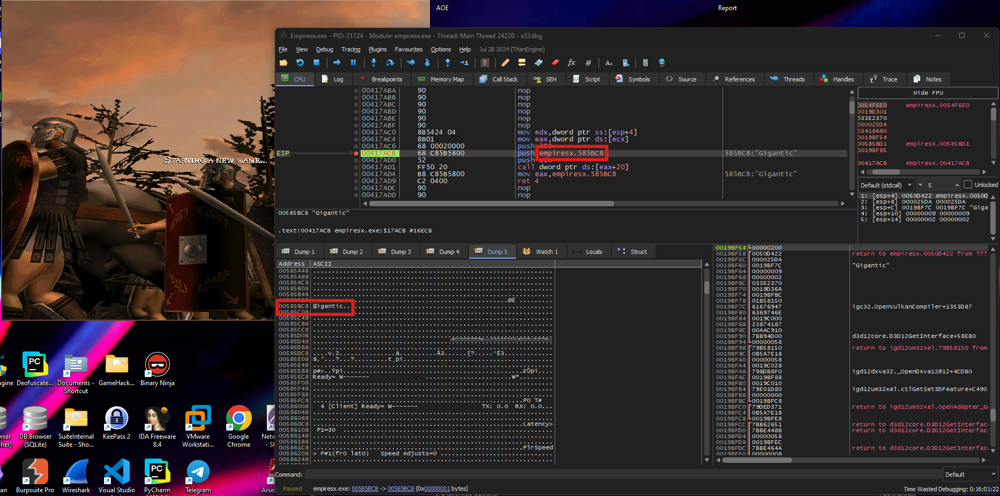
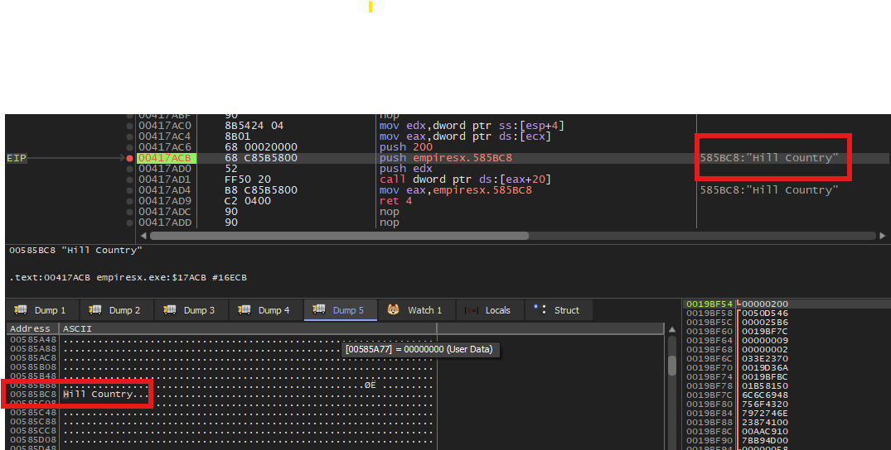

- Spectating the memory region, we can see lots of other settings too: 

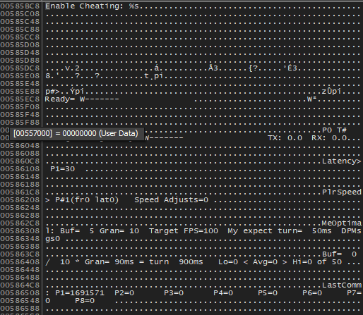

- We could also modify game sounds. By spectating the memory region, we could see the sound settings:

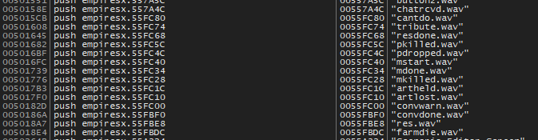 

- We could patch this value to changing the game sound to different soundtracks in our favor. Or simply hook the calls to redirect to our custom soundtracks.
- Install hook location:
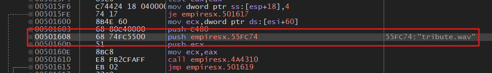 

---
2. Game Logic Reversing:
- We could also reverse the game logic to understand how the game works and how the game access the memory location. This way we could understand the game better and could make more complex cheats.

- The above function is function adding resources to the player object. We could patch this function to add more resources to the player object. To find it, set a break point at the memory location of the function then run the game and add resources to the player object. The break point will be hit, and we could see the function that adds resources to the player object.

- 
- Function asm code:
```asm
sub_45DF10      proc near               ; CODE XREF: sub_4F9040+4B↓p
.text:0045DF10                                         ; DATA XREF: .rdata:00549CE8↓o
.text:0045DF10
.text:0045DF10 arg_0           = word ptr  4
.text:0045DF10 arg_4           = dword ptr  8
.text:0045DF10
.text:0045DF10                 mov     ax, [esp+arg_0]
.text:0045DF15                 test    ax, ax
.text:0045DF18                 jl      short locret_45DF32
.text:0045DF1A                 cmp     ax, [ecx+4Ch]
.text:0045DF1E                 jge     short locret_45DF32
.text:0045DF20                 mov     ecx, [ecx+50h]
.text:0045DF23                 fld     [esp+arg_4]
.text:0045DF27                 movsx   eax, ax
.text:0045DF2A                 fadd    dword ptr [ecx+eax*4]
.text:0045DF2D                 lea     eax, [ecx+eax*4]
.text:0045DF30                 fstp    dword ptr [eax]
.text:0045DF32
.text:0045DF32 locret_45DF32:                          ; CODE XREF: sub_45DF10+8↑j
.text:0045DF32                                         ; sub_45DF10+E↑j
.text:0045DF32                 retn    0Ch
.text:0045DF32 sub_45DF10      endp
```
- The instruction responsible for adding resources in `fld     [esp+arg_4]` to the player object is `fadd dword ptr [ecx+eax*4]`. We could patch this instruction to add more resources to the player object. Then store the object address in [eax] register
- Eg: 
```asm
fadd dword ptr [ecx+eax*4] -> fadd dword ptr [ecx+eax*4] + 10000
fadd dword ptr [ecx+eax*4] -> fmul dword ptr [ecx+eax*4]
```
- The function is also responsible for all the resource modification. We could patch this function to `add` more resources to the player object.
- Before Hook:

    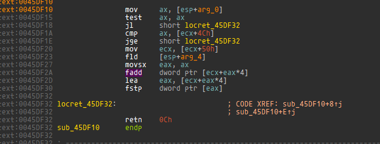

- After Hook:

- Redirect instruction flow to our code and jump back after executing our code:
```c
DWORD OriginalAddress = 0x0045DF2A;                 // Address of the original function
__declspec(naked) void HookFunc() {
	__asm {
        // Modify the floating-point value being loaded
        add dword ptr[esp + 8], 100   // Adjust the value at [esp + 8] (account for pushad)
        // Execute the original instructions
        fld dword ptr[esp + 8]          // Restore original instruction
        movsx eax, ax                   // Restore original instruction

        // Jump back to the original code
		jmp OriginalAddress		    // Jump back to the original code
	}
}
```
- Our function in memory:

- However, this function is used by all player objects. If we patch this function, all player objects will have the same effect. This also leads us to another player object: 


- Additionally, to directly patching the instruction, we also could hook the specific address to perform function detouring to add more resources to the player object.
- In our case, we could hook at: `fld dword ptr ss:[esp+8]` which is `0x0045DF23` and `jmp` back at `0045DF2A`
```asm
0045DF1A | 66:3B41 4C                 | cmp ax,word ptr ds:[ecx+4C]                     |
0045DF1E | 7D 12                      | jge empiresx.45DF32                             |
0045DF20 | 8B49 50                    | mov ecx,dword ptr ds:[ecx+50]                   |
0045DF23 | D94424 08                  | fld dword ptr ss:[esp+8]                        |
0045DF27 | 0FBFC0                     | movsx eax,ax                                    |
0045DF2A | D80481                     | fadd dword ptr ds:[ecx+eax*4]                   |
0045DF2D | 8D0481                     | lea eax,dword ptr ds:[ecx+eax*4]                |
0045DF30 | D918                       | fstp dword ptr ds:[eax]                         |
```
- Applying the same method (Break and Trace), we can also find other functions that related to the game logic: 
  1. Function at `0x004F3AE0` that responsibly subtracts resources from the player object when spending resources
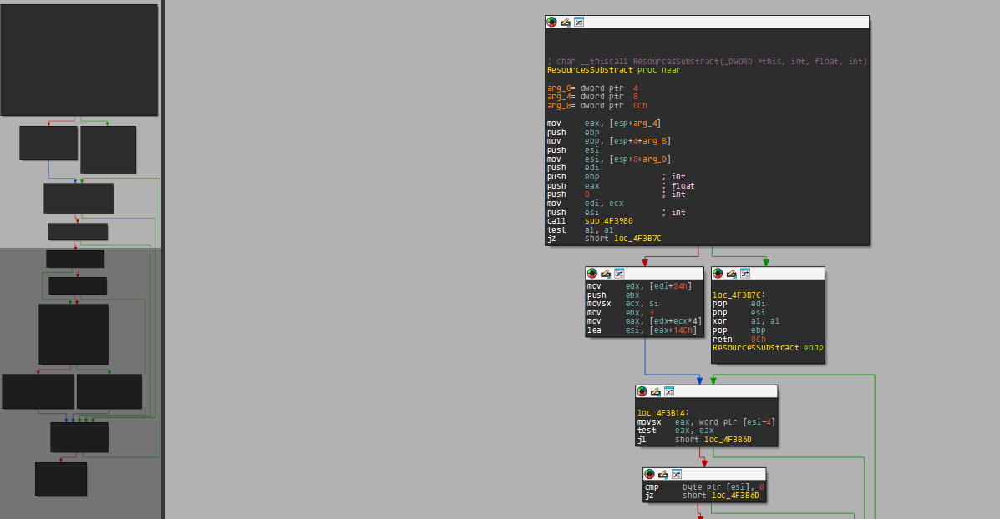
   ```asm
   004F3AE0 ; char __thiscall ResourcesSubstract(_DWORD *this, int, float, int)
   ```

     ```asm
   // Instruction Responsible for subtracting resources
     loc_4F3B63:                  ; CODE XREF: ResourcesSubstract+6C↑j
     .text:004F3B63                 fld     dword ptr [ecx+edx]
     .text:004F3B66                 fsub    st, st(1)
     .text:004F3B68                 fstp    dword ptr [ecx+edx]
     .text:004F3B6B                 fstp    st(0)
     ``` 
     - Function at `004F3A10` that responsible for adding resources to the player object when spending resources. We could modify this function to add more resources to the player object when spending resources. 
     ```asm
   // Patching fsub to fadd
   .text:004F3B66                 fadd    st, st(1)
     ```
     - We could also use the hook method to hook at `.text:004F3B63                 fld     dword ptr [ecx+edx]` to jump to our code cave then jump back to the original code.
     - Code Cave for function detouring:
     ```asm
    DWORD OriginalAddress = 0x004F3B66;                 
    __declspec(naked) void HookFunc() {
        __asm {
            // Modify the floating-point value being loaded
            mov dword ptr[esp + 8], 0   
            // Execute the original instructions
            fld dword ptr[esp + 8]          
    
            // Jump back to the original code
            jmp OriginalAddress		        // Jump back to the original code
        }
    }
  ```
   2. Function `0x004AF2E0` calculates damage deals by units to other building units 
    ```asm
    .text:004AF2E0 sub_4AF2E0      proc near               ; DATA XREF: .rdata:0054D138↓o
    .text:004AF2E0
    .text:004AF2E0 var_4           = dword ptr -4
    .text:004AF2E0 arg_0           = dword ptr  4
    .text:004AF2E0 arg_4           = dword ptr  8
    .text:004AF2E0 arg_8           = dword ptr  0Ch
    .text:004AF2E0 arg_C           = dword ptr  10h
    .text:004AF2E0 arg_10          = dword ptr  14h
    ```
  - Instruction at `0x004AF368` that calculates the damage deals by units to other building units
  ```asm 
    .text:004AF364                 fld     [esp+10h+var_4]
    .text:004AF368                 fsub    dword ptr [edi+30h]
    .text:004AF36B                 fcomp   ds:dbl_54D350
    .text:004AF371                 fnstsw  ax
    .text:004AF373                 test    ah, 1
  ```
   3. Arrays of current units and buildings in the game
    - However, there is no more we can do about it other than changing its value 
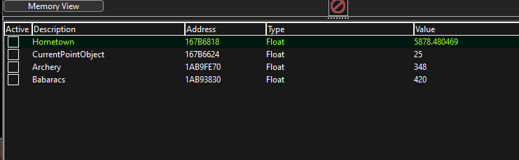
- Many more functions that related to the game logic, but it would crash the game if we patch it. Eg: Draw map, Resource generation, etc.. But since the game codebase is too large, we only focus on the resources and player objects.
 
#### String References
- We could also find the string references in the game binaries. This could help us to understand the game better and could make more complex cheats.
- We could use IDAPro to find the string references in the game binaries.
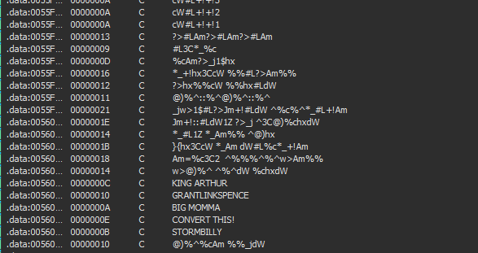
- If you are familiar with the game, you would recognize the string references. These are game cheat codes. We could use these cheat codes to make the game easier.
- All these strings are all called from the same function. We could patch this function to enable all the cheat codes in the game.
- Decompiled function:
```asm
int __thiscall sub_5061E0(_DWORD *this, int a2, char *Buffer)
```
- I have already reversed the function. We could patch this function to enable all the cheat codes in the game. 
- It checks user input then obfuscates it to match the string store in the game memory. 
- If the input obfuscated string match the string in the game memory, it will return an integer then pass it to the second process cheat function. Otherwise, it would print out as a chat message. 
```asm
char *__cdecl ObfuscateCheatCode(char *a1, char *a2, int InputLength)
{
  char *result; // eax
  char UserInput; // cl
  int v5; // esi
  char *i; // edi
  int v7; // ecx
  char *v8; // eax

  result = a2;
  UserInput = *a1;
  v5 = 0;
  for ( i = a1 + 1; UserInput; UserInput = *i++ )
  {
    if ( v5 >= InputLength )
      break;
    if ( UserInput < 'A' || UserInput > '_' )
    {
      *result++ = UserInput;
      ++v5;
    }
    else
    {
      v7 = *(_DWORD *)&aTpnlTimRenderT[4 * UserInput + 4];
      *result = BYTE1(v7);
      v8 = result + 1;
      *v8 = v7;
      result = v8 + 1;
      v5 += 2;
    }
  }
  *result = 0;
  return result;
}
```
- Based on the above obfuscate function, I have developed a function to deobfuscate all the strings in the memory: 
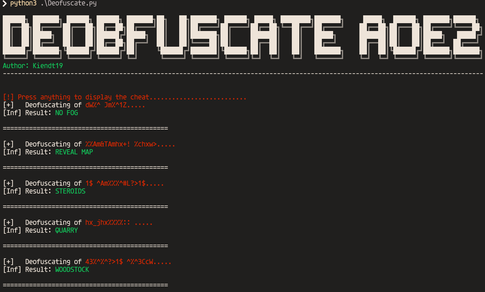

- Now we have known the cheat logic, I could perform dymamic analysis to find the function that calls this function then patch it to enable all the cheat codes in the game.
- Reversing how the cheat works: 
  - `Steroids` cheat code. We already know cheat code for `steroids` is `1$ ^Am%%%^#L?>1$`. Find references to this string in IDA then set a break point at the memory location of the function that calls this string. Run the game and type the cheat code. The break point will be hit, and we could see the function that calls this string.
    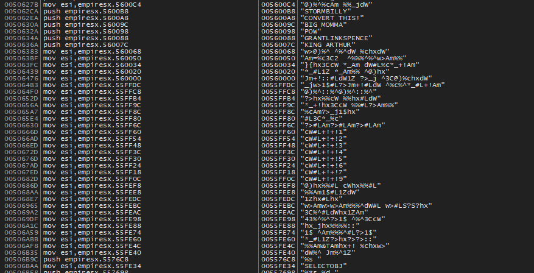
    - Goto the function that calls the string and patch it to enable all the cheat codes in the game. 
      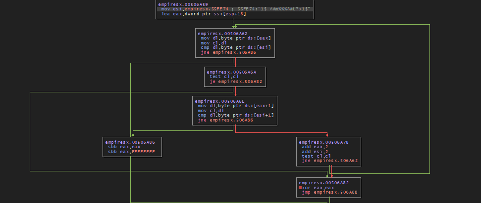!
    - Break and trace to understand the asm flow 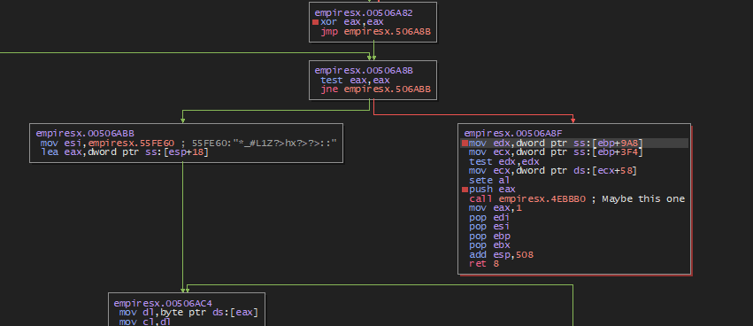

    - Basically, the cheat store user input in memory and obfuscate it to match the string in the game memory. If the string matches, it will return an integer then pass it to the second process cheat function. Otherwise, it would print out as a chat message (Left). 
    - But this specific cheat has an interesting functionality which can be toggled on/off. So it has to store current cheat status somewhere in the memory. Look at the asm at instruction `test edx,edx`, it checks the cheat status. We could patch this instruction to always return true then the cheat will always be enabled. 
  - The same method applies to every other cheats in the game. 
## Result 
1. Result overview
   - Successfully implement Injector to inject DLL to a game process. 

   - Successfully found address of our player object and resources along with other player objects current resources. 

   - Successfully found the pointer that consistently points to the memory location of the object, even after the game restarts.

   - Successfully modified the value stored at the identified memory address and observed its effects on the game.

2. Software Testing 
    - Injector for DLL Injection (Using basic WinAPI calls)
    - Function to automate finding target address: Function takes 4 Arguments DWORD baseAddress, DWORD offsets[], HANDLE processHandle, int size
    - Function to adding resources: After getting Address, we just need to write to it: Adding all resources to a custom float value (Current Setting **10000**)
    - Function to modify population: After getting Address, we just need to write to it: Modify population to unlimited (Default limits **200**)
    - Hook Function to redirect a code cave for custom instruction (Function Detour And Function Hooking): Modify Add, Subtract resources, Damage deals by units to building 
    - Export Function for DLL: Work as API for external Executable to use 

