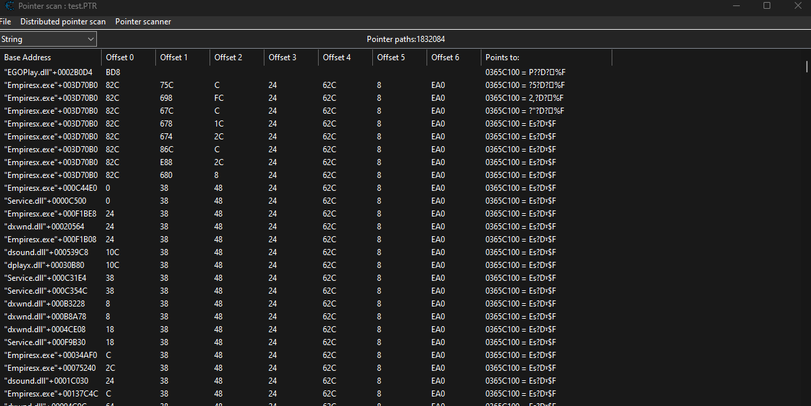
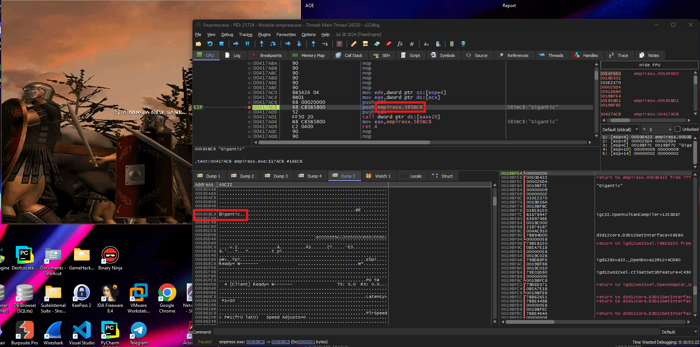
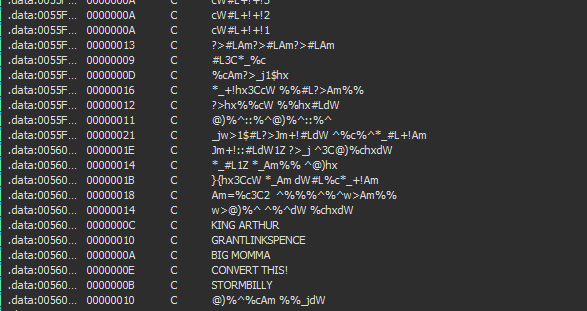
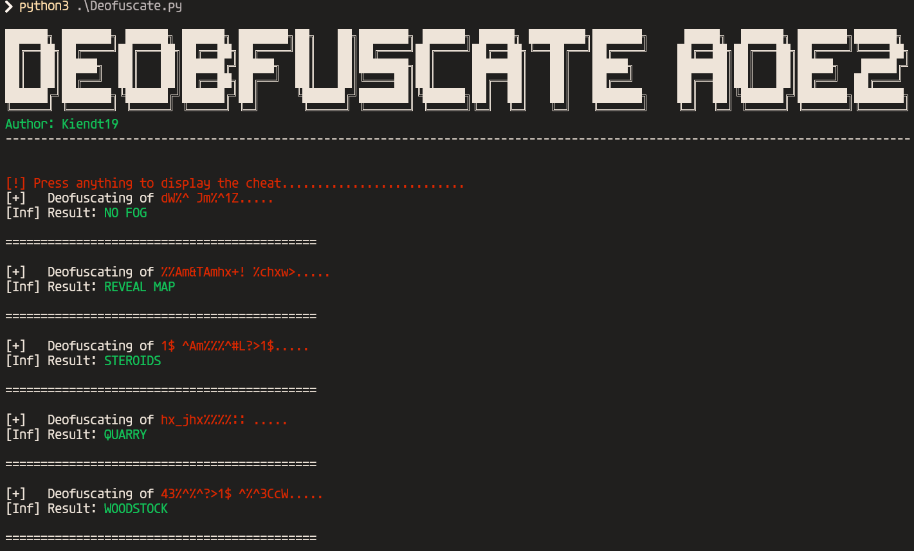

# Game Hacking Report

### Introduction
Game hacking involves understanding the underlying memory structures of a game, identifying objects of interest during runtime, and manipulating their values to observe how they affect the game's behavior. This report outlines the step-by-step process for memory scanning, retrieving multi-level pointers, and modifying memory bytes to achieve desired outcomes in a controlled environment. Finally develop a functional program to do all the above things automatically. 

---

### Tools

- **Memory Scanning**: CheatEngine
- **Reverse Engineering**: 
  - Static Analysis: IDAPro 7.7
  - Dynamic Analysis: X32Dbg 
- **Development**: Visual Studio

---

## Research

### Memory Scanning
#### Objectives:
To locate the memory address of in-game objects during runtime, enabling further analysis and modification.

#### Theory:
1. **Identify the Object of Interest:**
   - Launch the game and determine which in-game object you want to manipulate (e.g., player health, ammo count, or position).

2. **Attach a Memory Scanner:**
   - Use tools like Cheat Engine or x64dbg to attach to the game's process.

3. **Perform a Value Search:**
   - Search for the initial value of the object (e.g., current health) in the memory scanner.
   - Refine the results by updating the value in-game and rescanning until a single address is identified.

4. **Validate the Address:**
   - Confirm the address by modifying its value and observing the effect in-game.

#### Practice:

- Finding for food value by first scan for floating value of any resourses in the game and spent some to change values then perform second scan:


- After retrieve address of the resourse at `0x0365C100`, we could modify its to see if its actually the correct address: 


- We could also do this in X32Dbg by search for pattern. But the process is much more complicated than using CheatEngine. But the hex view of X32Dbg might be worth it: 

- At the same memory location, we also found others resources: 
  -  Food 
  -  Wood
  -  Gold 
  -  Stone 
  -  Max Population
  -  Current Population 
  -  Age
  -  Technology Count (Changing this will take affect on the game but the icons to update will still be there)
  -  Player Scores 
  -  Map Exploration (We couldn't patch this value however we could know which asm instruction access this memory location then do more reversing to get the logic of its)

- We have found the right address. However this is a dynamic address. Which mean if the game start again, the address going to be diffirent. We need to find static pointer that always point to this dynamic address, this way we could know the address of player's object everytime the game start. 
---

### Retrieve Multi-Level Pointers
#### Objectives:
To find the pointer that consistently points to the memory location of the object, even after the game restarts.

#### Theory:
1. **Locate the Dynamic Address:**
   - Start by identifying the dynamic address of the object as described in the memory scanning process.

2. **Pointer Scan:**
   - Use the memory scanner's pointer scan feature to identify potential pointers to the dynamic address.

3. **Test Pointer Stability:**
   - Restart the game and verify if the pointers still lead to the correct object. Eliminate invalid pointers.

4. **Resolve Multi-Level Pointers:**
   - If the pointer is indirect, repeat the process to find pointers to the base address. This process continues until a reliable base pointer is identified.

#### Practice:
- How the multi-level Pointer works:
  - Very simple, it dereferences a next pointer to get to the next pointer until it reach the final destination
- This step is straight forward, we just need to perform a pointer scan for the address:

- We could use any of theses pointers found in the table scan with base address is `Empiresx.exe`
- By deferencing the pointer we could get the final address of the player object:
  


- Deferencing each pointer to get to the final Address by using `ReadProcessMemory` API, iterate through each pointer to get to the final address:
```c
 // +10000 Food, Wood, Gold, Stone 
 HWND hGameWindow = FindWindow(NULL, L"Age of Empires Expansion");

 DWORD pID = 0;
 GetWindowThreadProcessId(hGameWindow, &pID);
 HANDLE processHandle = OpenProcess(PROCESS_ALL_ACCESS, FALSE, pID);

 TCHAR gameName[13];
 wcscpy_s(gameName, 13, L"Empiresx.exe");
 DWORD gameBaseAddress = GetModuleBaseAddress(gameName, pID);


 DWORD offsetGameToBaseAddress = 0x003C4B18;
 DWORD pointsOffsets[] = { 0x3c, 0x100, 0x50, 0x0 };
 DWORD baseAddress = 0;


 ReadProcessMemory(processHandle, (LPVOID)(gameBaseAddress + offsetGameToBaseAddress), &baseAddress, sizeof(baseAddress), NULL);


 DWORD pointsAddress = baseAddress;
 for (int i = 0; i < sizeof(pointsOffsets) / sizeof(pointsOffsets[0]) - 1; i++) {
     ReadProcessMemory(processHandle, (LPVOID)(pointsAddress + pointsOffsets[i]), &pointsAddress, sizeof(pointsAddress), NULL);
 }
 pointsAddress += pointsOffsets[sizeof(pointsOffsets) / sizeof(pointsOffsets[0]) - 1];

// pointsAddress is the final address of the player objects
```

---

### Modify Memory Bytes
#### Objectives:
To manipulate the value stored at the identified memory address and observe its effects on the game.

#### Process:
1. **Identify the Address to Modify:**
   - Use the pointer or dynamic address retrieved in the previous steps.

2. **Change the Value:**
   - Modify the value directly in the memory scanner or write a script to do so.

3. **Observe the Outcome:**
   - Monitor the game to see how the changes affect the object (e.g., infinite health, increased speed, or unlimited ammo).

4. **Automate the Process (Optional):**
   - Use programming languages like Python or C++ to create a trainer or script that automates memory modification.

#### Practice:
- After getting the final address of the player object, we could modify the value of the resources to see if it actually take affect on the game. Base on the hex view of the game, we could see that the resources are stored in the memory as float value and each resources are stored 4 offset away from each other.
- We could use `WriteProcessMemory` API to write the new value to the memory location:
```c
float currentFood;
float currentWood;
float currentStone;
float currentGold;

ReadProcessMemory(processHandle, (LPVOID)(pointsAddress), &currentFood, sizeof(currentFood), NULL);
ReadProcessMemory(processHandle, (LPVOID)(pointsAddress), &currentWood, sizeof(currentWood), NULL);
ReadProcessMemory(processHandle, (LPVOID)(pointsAddress), &currentStone, sizeof(currentStone), NULL);
ReadProcessMemory(processHandle, (LPVOID)(pointsAddress), &currentGold, sizeof(currentGold), NULL);


float addResource = 10000;


float newFood = currentFood + addResource;
float newWood = currentWood + addResource;
float newStone = currentStone + addResource;
float newGold = currentGold + addResource;

WriteProcessMemory(processHandle, (LPVOID)pointsAddress, &newFood, sizeof(newFood), 0);
WriteProcessMemory(processHandle, (LPVOID)(pointsAddress + 4), &newWood, sizeof(newWood), 0);
WriteProcessMemory(processHandle, (LPVOID)(pointsAddress + 8), &newStone, sizeof(newStone), 0);
WriteProcessMemory(processHandle, (LPVOID)(pointsAddress + 12), &newGold, sizeof(newGold), 0);
```
- Each resources are stored 4 offset away from each other. We could use the same method to modify the resources.
- Max Population: 
```C
DWORD offsetGameToBaseAddress = 0x003C4B18;
DWORD pointsOffsets[] = { 0x3c, 0x100, 0x50, 0x0 };
DWORD baseAddress = 0;

ReadProcessMemory(processHandle, (LPVOID)(gameBaseAddress + offsetGameToBaseAddress), &baseAddress, sizeof(baseAddress), NULL);


DWORD pointsAddress = baseAddress;
for (int i = 0; i < sizeof(pointsOffsets) / sizeof(pointsOffsets[0]) - 1; i++) {
    ReadProcessMemory(processHandle, (LPVOID)(pointsAddress + pointsOffsets[i]), &pointsAddress, sizeof(pointsAddress), NULL);
    //   printf("Debug Info: Value at Offset = 0x%lx\n", pointsAddress);
}
pointsAddress += pointsOffsets[sizeof(pointsOffsets) / sizeof(pointsOffsets[0]) - 1];

DWORD populationAddress = pointsAddress + 0x10;
float currentPopulation;

ReadProcessMemory(processHandle, (LPVOID)(populationAddress), &currentPopulation, sizeof(currentPopulation), NULL);

float newPopulation = 10000;
WriteProcessMemory(processHandle, (LPVOID)(populationAddress), &newPopulation, sizeof(newPopulation), 0);  
```
- Reset population to 0: 
```C
DWORD offsetGameToBaseAddress = 0x003C4B18;
DWORD pointsOffsets[] = { 0x3c, 0x100, 0x50, 0x0 };
DWORD baseAddress = 0;

ReadProcessMemory(processHandle, (LPVOID)(gameBaseAddress + offsetGameToBaseAddress), &baseAddress, sizeof(baseAddress), NULL);


DWORD pointsAddress = baseAddress;
for (int i = 0; i < sizeof(pointsOffsets) / sizeof(pointsOffsets[0]) - 1; i++) {
    ReadProcessMemory(processHandle, (LPVOID)(pointsAddress + pointsOffsets[i]), &pointsAddress, sizeof(pointsAddress), NULL);
   
}
pointsAddress += pointsOffsets[sizeof(pointsOffsets) / sizeof(pointsOffsets[0]) - 1];
float currentPopulation;

ReadProcessMemory(processHandle, (LPVOID)(pointsAddress + 44), &currentPopulation, sizeof(currentPopulation), NULL);

float resetPop = 0;
WriteProcessMemory(processHandle, (LPVOID)(pointsAddress + 44), &resetPop, sizeof(resetPop), 0);
```
### Reversing Game Logic 

1. Game Settings Reversing:
- Before the game start it will load game settings. We can directly modify this setting into the game binaries




- Spectating the memory region we can see alots of others settings too: 


---
2. Game Logic Reversing:
- We could also reverse the game logic to understand how the game works and how the game access the memory location. This way we could understand the game better and could make more complex cheats.

- The above function is function adding resources to the player object. We could patch this function to add more resources to the player object. To find it, set a break point at the memory location of the function then run the game and add resources to the player object. The break point will be hit and we could see the function that add resources to the player object.

- 
- Function asm code:
```asm
sub_45DF10      proc near               ; CODE XREF: sub_4F9040+4B↓p
.text:0045DF10                                         ; DATA XREF: .rdata:00549CE8↓o
.text:0045DF10
.text:0045DF10 arg_0           = word ptr  4
.text:0045DF10 arg_4           = dword ptr  8
.text:0045DF10
.text:0045DF10                 mov     ax, [esp+arg_0]
.text:0045DF15                 test    ax, ax
.text:0045DF18                 jl      short locret_45DF32
.text:0045DF1A                 cmp     ax, [ecx+4Ch]
.text:0045DF1E                 jge     short locret_45DF32
.text:0045DF20                 mov     ecx, [ecx+50h]
.text:0045DF23                 fld     [esp+arg_4]
.text:0045DF27                 movsx   eax, ax
.text:0045DF2A                 fadd    dword ptr [ecx+eax*4]
.text:0045DF2D                 lea     eax, [ecx+eax*4]
.text:0045DF30                 fstp    dword ptr [eax]
.text:0045DF32
.text:0045DF32 locret_45DF32:                          ; CODE XREF: sub_45DF10+8↑j
.text:0045DF32                                         ; sub_45DF10+E↑j
.text:0045DF32                 retn    0Ch
.text:0045DF32 sub_45DF10      endp
```
- The instruction responsible for adding resources in `fld     [esp+arg_4]` to the player object is `fadd dword ptr [ecx+eax*4]`. We could patch this instruction to add more resources to the player object. Then store the object address in [eax] register
- Eg: 
```asm
fadd dword ptr [ecx+eax*4] -> fadd dword ptr [ecx+eax*4] + 10000
fadd dword ptr [ecx+eax*4] -> fmul dword ptr [ecx+eax*4]
```
- The function also responsible for all the resources modification. We could patch this function to add more resources to the player object.

- Redirect instruction flow to our code and jump back after executing our code:
```c
DWORD OriginalAddress = 0x0045DF2A;                 // Address of the original function
__declspec(naked) void HookFunc() {
	__asm {
        // Modify the floating-point value being loaded
        add dword ptr[esp + 8], 100   // Adjust the value at [esp + 8] (account for pushad)
        // Execute the original instructions
        fld dword ptr[esp + 8]          // Restore original instruction
        movsx eax, ax                   // Restore original instruction

        // Jump back to the original code
		jmp OriginalAddress		    // Jump back to the original code
	}
}
```


- However this function is used by all player object. If we patch this function, all player object will have the same affect. This also lead we to other's player object: 


- Additional to directly patching the instruction, we also could hook the specific address to perform function detouring to add more resources to the player object.
- In our case, we could hook at: `fld dword ptr ss:[esp+8]` which is `0x0045DF23` and `jmp` back at `0045DF2A`
```asm
0045DF1A | 66:3B41 4C                 | cmp ax,word ptr ds:[ecx+4C]                     |
0045DF1E | 7D 12                      | jge empiresx.45DF32                             |
0045DF20 | 8B49 50                    | mov ecx,dword ptr ds:[ecx+50]                   |
0045DF23 | D94424 08                  | fld dword ptr ss:[esp+8]                        |
0045DF27 | 0FBFC0                     | movsx eax,ax                                    |
0045DF2A | D80481                     | fadd dword ptr ds:[ecx+eax*4]                   |
0045DF2D | 8D0481                     | lea eax,dword ptr ds:[ecx+eax*4]                |
0045DF30 | D918                       | fstp dword ptr ds:[eax]                         |
```

#### String References
- We could also find the string references in the game binaries. This could help us to understand the game better and could make more complex cheats.
- We could use IDAPro to find the string references in the game binaries.

- If you familiar with the game, you would recognize the string references. These are game cheat codes. We could use these cheat codes to make the game easier.
- All these strings are all call from the same function. We could patch this function to enable all the cheat codes in the game.
- Decompiled function:
```asm
int __thiscall sub_5061E0(_DWORD *this, int a2, char *Buffer)
{
  int v4; // eax
  int v6; // eax
  int v7; // eax
  int v8; // ecx
  int v9; // ecx
  int v10; // [esp+10h] [ebp-508h] BYREF
  int v11; // [esp+14h] [ebp-504h] BYREF
  char v12[512]; // [esp+18h] [ebp-500h] BYREF
  unsigned __int8 String[256]; // [esp+218h] [ebp-300h] BYREF
  char v14[256]; // [esp+318h] [ebp-200h] BYREF
  char v15[256]; // [esp+418h] [ebp-100h] BYREF

  if ( !Buffer )
    return 0;
  if ( a2 < 0 )
    return 0;
  if ( a2 >= *(__int16 *)(this[253] + 60) )
    return 0;
  strcpy((char *)String, Buffer);
  _mbsupr(String);
  ObfuscateCheatCode((char *)String, v12, 512);
  if ( !sub_41BD50(this) )
    return 0;
  if ( !strcmp(v12, aCamJdw) && sub_41BD00(this) )
  {
    ProcessCheat(102);
    return 1;
  }
  if ( strstr((const char *)String, aStormbilly) )
  {
    ProcessCheat(14);
    return 1;
  }
  if ( strstr((const char *)String, aConvertThis) )
  {
    ProcessCheat(15);
    return 1;
  }
  if ( strstr((const char *)String, aBigMomma) )
  {
    ProcessCheat(16);
    return 1;
  }
  if ( strstr((const char *)String, off_560098) )
  {
    ProcessCheat(17);
    return 1;
  }
  if ( strstr((const char *)String, aGrantlinkspenc) )
  {
    ProcessCheat(18);
    return 1;
  }
  if ( strstr((const char *)String, aKingArthur) )
  {
    ProcessCheat(19);
    return 1;
  }
  if ( !strcmp(v12, aWDwChxdw) )
  {
    ProcessCheat(0);
    return 1;
  }
  if ( !strcmp(v12, aAmC3c2WAm) )
  {
    ProcessCheat(1);
    return 1;
  }
  if ( !strcmp(v12, aHx3ccwAmDwLCAm) )
  {
    ProcessCheat(2);
    return 1;
  }
  if ( !strcmp(v12, aL1zAmHx) )
  {
    ProcessCheat(3);
    return 1;
  }
  if ( !strcmp(v12, aJmLdw1zJ3cChxd) )
  {
    ProcessCheat(4);
    return 1;
  }
  if ( !strcmp(v12, aJw1LJmLdwCLAm) )
  {
    ProcessCheat(7);
    return 1;
  }
  if ( !strcmp(v12, asc_55FFC8) )
  {
    ProcessCheat(8);
    return 1;
  }
  if ( !strcmp(v12, aHxCwHxLdw) )
  {
    ProcessCheat(10);
    return 1;
  }
  if ( !strcmp(v12, aHx3ccwLAm) )
  {
    ProcessCheat(11);
    return 1;
  }
  if ( !strcmp(v12, aCamJ1Hx) )
  {
    ProcessCheat(12);
    return 1;
  }
  if ( !strcmp(v12, aL3cC) )
  {
    ProcessCheat(13);
    return 1;
  }
  if ( sub_41BD00(this) )
  {
    if ( !strcmp(v12, aLamLamLam) )
    {
      ProcessCheat(100);
      return 1;
    }
    if ( !strcmp(v12, aCwL1) )
    {
      ProcessCheat(201);
      return 1;
    }
    if ( !strcmp(v12, aCwL2) )
    {
      ProcessCheat(202);
      return 1;
    }
    if ( !strcmp(v12, aCwL3) )
    {
      ProcessCheat(203);
      return 1;
    }
    if ( !strcmp(v12, aCwL4) )
    {
      ProcessCheat(204);
      return 1;
    }
    if ( !strcmp(v12, aCwL5) )
    {
      ProcessCheat(205);
      return 1;
    }
    if ( !strcmp(v12, aCwL6) )
    {
      ProcessCheat(206);
      return 1;
    }
    if ( !strcmp(v12, aCwL7) )
    {
      ProcessCheat(207);
      return 1;
    }
    if ( !strcmp(v12, aCwL9) )
    {
      ProcessCheat(208);
      return 1;
    }
  }
  if ( !strcmp(v12, aHxLCwhxL) )
  {
    ProcessCheat(101);
    return 1;
  }
  if ( !strcmp(v12, aAm1L1zdw) )
  {
    ProcessCheat(103);
    return 1;
  }
  if ( strcmp(v12, a1zhxLhx) )
  {
    if ( !strcmp(v12, aWAmwWAmDwLWLsS) )
    {
      ProcessCheat(20);
      return 1;
    }
    if ( !strcmp(v12, a3cLdwhx1zam) )
    {
      ProcessCheat(21);
      return 1;
    }
    if ( !strcmp(v12, a4313ccw) )
    {
      ProcessCheat(23);
      return 1;
    }
    if ( !strcmp(v12, aHxJhx) )
    {
      ProcessCheat(22);
      return 1;
    }
    if ( !strcmp(v12, a1AmL1) )
    {
      sub_4EBBB0(this[618] == 0);
      return 1;
    }
    if ( !strcmp(v12, aL1zHx) )
    {
      ProcessCheat(220);
      return 1;
    }
    if ( !strcmp(v12, aAmTamhxChxw) )
    {
      ProcessCheat(230);
      return 1;
    }
    if ( !strcmp(v12, aDwJm1z) )
    {
      ProcessCheat(231);
      return 1;
    }
    sscanf((const char *const)String, "%s ", v14);
    if ( !strcmp(v14, aSelectobj) )
    {
      sscanf(Buffer, "%*s %d ", &v10);
      v6 = sub_5230D0(v10);
      if ( v6 )
      {
        *(_BYTE *)(v6 + 54) = 1;
        *(_DWORD *)(*(_DWORD *)(*(_DWORD *)(this[253] + 64) + 4 * a2) + 308) = v6;
      }
    }
    if ( !strcmp(v14, aRunplay) )
    {
      sscanf(Buffer, "%*s %d %s %d ", &v11, v15, &v10);
      v7 = sub_40ECF0(v15);
      if ( v7 != -1 )
      {
        v8 = *(_DWORD *)(*(_DWORD *)(this[253] + 64) + 4 * a2);
        (*(void (__thiscall **)(int, int, int, int))(*(_DWORD *)v8 + 80))(v8, v11, v10, v7);
        return 1;
      }
      return 1;
    }
    if ( !strcmp(v12, aSAmJ1) )
    {
      v9 = *(_DWORD *)(*(_DWORD *)(this[253] + 64) + 4 * a2);
      (*(void (__thiscall **)(int, int, _DWORD, _DWORD, _DWORD, _DWORD))(*(_DWORD *)v9 + 84))(v9, a2, 0, 0, 0, 0);
      return 1;
    }
    return 0;
  }
  v4 = sub_41A260(this);
  sub_45EC20(v4);
  if ( this[109] == 6 && this[110] == 1 )
    (*(void (__thiscall **)(_DWORD *, _DWORD, _DWORD))(*this + 16))(this, 0, 0);
  (*(void (__thiscall **)(_DWORD *, _DWORD))(*this + 20))(this, 0);
  return 1;
}
```
- I have already reversed the function. We could patch this function to enable all the cheat codes in the game. 
- It check user input then obfuscate it to match the strings store in the game memory. 
- If the input obfuscated string match the string in the game memory, it will return an integer then pass it to second process cheat function. Otherwise it would print out as chat message. 
```asm
char *__cdecl ObfuscateCheatCode(char *a1, char *a2, int InputLength)
{
  char *result; // eax
  char UserInput; // cl
  int v5; // esi
  char *i; // edi
  int v7; // ecx
  char *v8; // eax

  result = a2;
  UserInput = *a1;
  v5 = 0;
  for ( i = a1 + 1; UserInput; UserInput = *i++ )
  {
    if ( v5 >= InputLength )
      break;
    if ( UserInput < 'A' || UserInput > '_' )
    {
      *result++ = UserInput;
      ++v5;
    }
    else
    {
      v7 = *(_DWORD *)&aTpnlTimRenderT[4 * UserInput + 4];
      *result = BYTE1(v7);
      v8 = result + 1;
      *v8 = v7;
      result = v8 + 1;
      v5 += 2;
    }
  }
  *result = 0;
  return result;
}
```
- Base on the above obfuscate function, i have developed a function to deobfuscate all the strings in the memory: 


- Now we have known the cheat logic, i could perform dymamic analysis to find the function that call this function then patch it to enable all the cheat codes in the game.
- Reversing how the cheat works: 
  - `Steroids`
## Development

